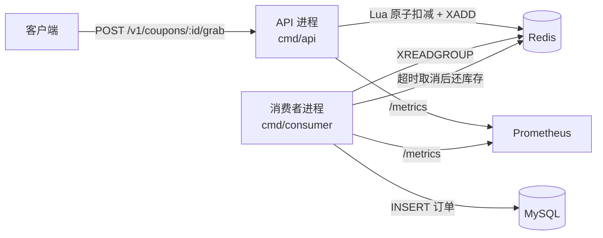
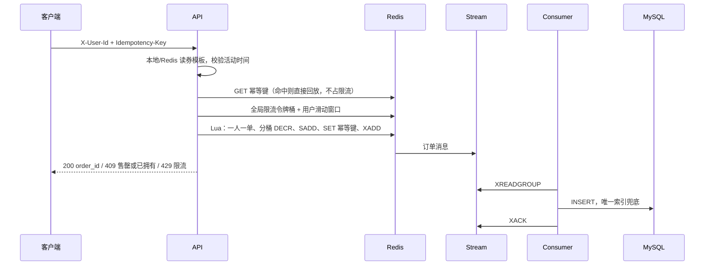

# 抢券系统设计

连锁茶饮品牌会在整点放券，例如下午 3 点放出 1 万张半价券。用户在开售后调用抢券接口，系统保证：

- 不超发：发出去的有效订单数不会超过券的总库存
- 一人一张：同一个用户对同一张券最多持有一张未取消的订单
- 同一张幂等键重复提交，不会扣两次库存
- 未支付订单超时自动回补库存
- 活动结束后可以用对账程序证明 Redis、MySQL、消息队列三者一致

下面所有路径都对应仓库里的真实代码。

## 总览



两个进程故意拆开：

| 进程 | 做什么 | 不做什么 |
|---|---|---|
| `cmd/api` | 限流、读券模板、执行 Lua、立刻返回 | 不在请求里写订单表 |
| `cmd/consumer` | 把流里的消息写成订单、超时取消、分桶再平衡 | 不接用户流量 |

请求线程里如果直接 `INSERT` 订单，所有人都会去争 InnoDB 的行锁和 fsync。Redis 预扣把这件事挪到后面。接口返回 `PENDING` 的意思是“库存已经占上，订单正在异步落库”，不是“数据库里已经有行”。

## 抢券请求怎么走



对应 `internal/seckill/service.go` 的 `Grab` 和 `internal/stock/redis_stock.go` 里的 `grabLua`。

Lua 返回码：

| 码 | 含义 | HTTP |
|---|---|---|
| 1 | 扣减成功，消息已入流 | 200 |
| 2 | 同一个幂等键已经成功过 | 200，`replay=true` |
| 3 | 用户已经在持有集合里（换了新的幂等键） | 409 `already_owned` |
| 5 | 所有分桶都是 0 | 409 `sold_out` |

## 为什么是一条 Lua，而不是锁

Redis 执行 Lua 时不会插入别的命令。所以“看库存、减库存、记下这个用户、写入订单流”要么全发生，要么全不发生。进程在脚本执行中崩溃，Redis 仍会把这条脚本跑完。

不用 `DECR` 再在客户端里判断，是因为两次往返之间别人也能 `DECR`。先减成负数再加回去，中间有一个超卖窗口，而且失败路径还要补库存，补的时候又可能和超时取消打架。

不用 `SETNX` 分布式锁，是因为锁会变成新的热点 key，还要处理过期、误删、续期。抢券的互斥点就是库存 key 本身，Lua 已经把它互斥了。

## 库存分桶

热点券如果只有一个 key，Redis Cluster 里这个槽会把单核打满，网络也堆在一个节点上。做法是把总库存拆成 N 份：

```
tb:coupon:{id}:stock:0
tb:coupon:{id}:stock:1
...
```

`stock.Split` 保证各桶之和严格等于总库存（前 `total%N` 个桶多 1）。用户用 FNV 哈希固定先打某一个桶（`PreferShard`），这样同一个人不会随机打到不同桶上。这个桶空了，Lua 会继续看后面的桶，所以哈希不均匀不会直接造成少卖，只是尾部请求要多看几个 key。

再平衡在 `internal/stock/rebalance.go`。最满和最空的差超过阈值时，只搬差额的一半。搬光会让两个桶下一秒对调回来，形成振荡。搬运本身也是一条 Lua：源桶不够就放弃，避免和正在进行的抢券扣出负数。

**单机 Redis 上，分桶通常不会提高 QPS。** Redis 主线程只有一个，N 个 key 还是同一条线程在跑。分桶的收益出现在多节点：每个桶落到不同实例。那样的话一条 Lua 就不能同时改所有桶（Lua 只在一个实例里原子）。这个项目的默认实现把所有桶放在同一个 Redis 上，用一条 Lua 保住原子性，分桶代码和再平衡是按多节点的形状写的。压测文档里会如实写单机上 Redis 单 key 和分桶谁更快，不假设分桶一定赢。

## 一人一单和幂等

这两件事经常被说成一件事，其实不是。

- **幂等键**回答“同一次点击重试了”。键存在就返回当时的订单号，库存不动。键的格式限制在 `[A-Za-z0-9_-]{1,80}`，因为 Lua 用 `|` 拼接 payload。
- **一人一单**回答“这个人是不是已经占着库存”。Redis 用集合 `tb:coupon:{id}:users`。换一个新的幂等键再来，会得到 `already_owned`，而不是再扣一份。

数据库再兜一层。MySQL 没有“只对未取消订单唯一”这种部分索引，所以 `orders.active_user_id` 在订单仍占库存时等于 `user_id`，取消时改成 `NULL`。唯一索引允许多个 NULL，于是：

- 同一用户可以留下很多张已取消的历史单
- 但只能有一张 `PENDING` 或 `CONFIRMED`

幂等键的唯一索引是 `(coupon_id, idempotency_key)`。消费者重复投递时，第二次 `INSERT` 会撞上这个索引，当成成功并 ACK。见 `internal/worker/worker.go` 的 `persist`。

订单表**不加**指向 `coupons` 的外键。外键插入时要检查父行，高并发下券那一行又会变成热点，Redis 预扣想躲开的锁从后门回来了。完整性交给对账，而不是外键。

## 消息队列为什么用 Redis Streams

候选有 Kafka、RabbitMQ、Redis Streams。这里用 Redis Streams，原因：

1. 扣库存和入队必须原子。它们已经和 Redis 在一起，放进同一条 Lua 的 `XADD` 里，就不存在“库存扣了，消息却没发出去”。Kafka 做不到和 Redis 扣减进同一个事务，中间死一次就要靠对账去补，窗口更大。
2. 消费组、PEL（已投递未 ACK）、`XAUTOCLAIM`、再投递次数都是现成的，足够做到至少一次投递，并由消费端幂等兜住重复。
3. 少一个需要单独运维的集群。一台机器上 `docker compose up` 就能把整条链路跑起来。

代价是：Streams 没有 Kafka 的分区再均衡和 ISR。订单消息要给别的业务线复用时，应该把“分配事实”留在 Redis，再异步转一道 Kafka。那个转换不在本项目的热路径上。

可靠性三点：

| 问题 | 做法 |
|---|---|
| 消息丢失 | `XADD` 和 `DECR` 在同一条 Lua 里。Redis 开了 AOF（`appendfsync everysec`） |
| 重复消费 | 处理成功才 `XACK`。重复投递撞上订单唯一索引，记成 `duplicate` 并 ACK |
| 毒消息 / 下游长时间故障 | `XAUTOCLAIM` 把空闲消息抢走重试。投递次数达到 `MAX_DELIVERIES` 就写入 `tb:stream:orders:dlq` 再 ACK，避免一条坏消息挡住整条流 |

坏 payload（字段解析失败）不会因为重试变好，第一次就进死信。数据库短暂不可用不是毒消息，留在 PEL 里重试。这个区别在 `worker.handle` 里。

## 超时取消

订单消息里带着 `expire_at`。消费者插入时状态是 `PENDING`。取消循环不是每秒只取最老的 100 行：默认 4 个协程一直扫（`CANCEL_PARALLEL` / `CANCEL_BATCH`）。

- 一半协程只领刚到期的窗口（默认 3 秒，`CANCEL_FRESH_WINDOW`）。库里有几十万张更老的过期单时，新超时的订单不用排在它们后面。
- 另一半按 `idx_status_expire (status, expire_at)` 从最老的开始清积压。
- 领取语句是 `SELECT ... ORDER BY expire_at LIMIT ? FOR UPDATE SKIP LOCKED`。多个协程不会锁同一行。读提交隔离，避免间隙锁把两条扫描粘在一起。

领走的行在同一个 MySQL 事务里改成 `CANCELLED`。然后才还库存，因为 MySQL 和 Redis 没有分布式事务（`internal/fulfill/cancel.go`）：

1. `UPDATE ... WHERE status='PENDING'`。只有一个并发取消能成功。DB 直写路径在同一个 SQL 事务里把 `coupons.remaining` 加回去。
2. Redis 路径再跑 `returnLua`：`SREM` 用户成功才 `INCRBY` 原桶。重试时用户已经不在集合里，就不会加第二次。

进程如果死在两步之间，`stock_returned` 还是 0。空闲的窗口协程会跑 `RepairReturns`，再调一次 Lua。确认订单（`POST /v1/orders/:id/confirm`）把状态改成 `CONFIRMED`，取消语句就匹配不到，库存不会被还回去。

实测时库里还有大约 89 万张过期未取消，一张 2 秒超时的新单从 `expire_at` 到状态变成取消是 0.066 秒，Redis 库存加回去是 0.085 秒。旧积压大约每秒清 600 张。数字和口径在 `docs/benchmark-realistic.md`。

## 缓存

库存数字**不缓存**。缓存的只是券名称、活动时间、分桶数。见 `internal/cache`。

| 问题 | 在这个项目里的做法 |
|---|---|
| 穿透 | 布隆过滤器。本地过滤器说没有时，再查一次 Redis 模板；Redis 也没有才 404，不打到 MySQL。过滤器本身没有假阴性，但每台 API 的过滤器是进程内的，别的实例刚创建的券要靠 Redis 模板补上 |
| 击穿 | `singleflight` 把同一个 id 的并发回源合成一次。逻辑过期：软 TTL 到了先返回旧值，后台刷新 |
| 雪崩 | 本地 TTL 加 0~20% 抖动。Redis 里的模板 hash 不设统一过期时间，避免同一秒集体失效 |

随机 id 打过来时，如果每个都做空值缓存，内存会被打满。本地过滤器说没有时，先查 Redis 模板；Redis 没有才 404，这次不写空值缓存。只有“过滤器说可能存在、数据库说没有”才写短 TTL 空值。多实例时这个 Redis 回查是必须的：创建券只更新本进程的过滤器，另一台 API 要靠 Redis 模板认识新券。只信本地过滤器会把大约一半请求打成 404，这是 `docs/benchmark-realistic.md` 里修之前的实测。

预热在 API 开始监听之前（`Service.Warmup`）。Redis 里如果已经有 `warmed` 标记，绝不会把库存覆盖回初始值。标记丢了（比如 Redis 没持久化被清空）才按 `总库存 - 数据库里仍有效的订单` 重建，避免把已经卖掉的量又加回去。

## 三种库存路径

同一套 HTTP 和订单表，创建券时用 `strategy` 选择。这是为了在同一台机器上做前后对比，而不是三套业务。

| strategy | 行为 |
|---|---|
| `db` | 请求线程里事务：`UPDATE coupons SET remaining=remaining-1 WHERE remaining>0`，然后插入订单。这是慢基线 |
| `redis` | 一个库存 key + Lua + 异步落库 |
| `sharded` | N 个库存 key，仍是一条 Lua + 异步落库 |

`coupons.remaining` 只对 `db` 有意义。Redis 路径的真实余量是各桶之和，看 `GET /v1/coupons/:id/stock`。

## 一致性：什么时候算账平

一张券自己的账（所有券共用一条流，所以全局限流意义上的 lag 不能算到某一张券头上）：

```
Redis 各桶之和 + PENDING 订单数 + CONFIRMED 订单数 = 总库存
Redis 持有用户数 = PENDING + CONFIRMED
重复的有效用户数 = 0
没有任何桶是负数
死信流为空，且没有“已取消但库存还没还”的行
```

如果这张券还有消息没落库，左边会小于总库存，`balanced` 为 false。别的券堵在同一条流里时，只要这张券自己的等式成立，就说明它的扣减都已经进了数据库。`snapshot` 里仍会带上整条流的 `MQPending` 和 `MQLag`，方便看消费者有没有积压。

DB 直写路径把 Redis 换成 `coupons.remaining`，并且不看消息队列。

活动进行中，等式可以暂时不成立：库存已经扣了，订单还在流里，所以 `Redis 剩余 + 已落库有效单 < 总库存`。这不是超卖。超卖的定义是“有效订单数 > 总库存”或“桶变成负数”，这两种任何时候都该是 0。

实现是纯函数 `reconcile.Evaluate`，读库的逻辑在 `Checker.Check`。命令行：

```bash
go run ./cmd/reconcile -coupon 1 -wait 30s
```

退出码 0 表示安静且账平，2 表示还没消化完或账不平。

## 限流

两层，都在扣库存之前，但在幂等回放之后（重试不该被自己的限流挡掉，否则用户会以为没抢到）：

- 全局：Redis 令牌桶，`GLOBAL_RPS`。`<=0` 表示关闭。压测默认关闭，否则测到的是限流器而不是库存路径。
- 用户：Redis ZSET 滑动窗口，`USER_LIMIT` / `USER_WINDOW`。member 用纳秒加序号，避免同一毫秒的请求互相覆盖把限额放宽。

进程内还有一个本地令牌桶（`ratelimit.LocalBucket`），不访问 Redis，给 `-race` 测试用。线上热路径用的是 Redis 那把，多实例才有同一个限额。

依赖故障时限流器失败即拒绝（503），不降级成“无限流放行”。限流挂了还继续扣库存，活动会被打穿。

## 可观测性

Prometheus 指标在 `internal/metrics/metrics.go`。标签只有结果和策略，没有 `user_id`。

- `teabreak_grab_requests_total{result,strategy}`
- `teabreak_grab_duration_seconds`
- `teabreak_consume_total{result}`：`inserted` / `duplicate` / `error` / `dlq` / `poison`
- `teabreak_dlq_messages_total`
- `teabreak_cancel_total`
- `teabreak_rebalance_moves_total`
- `teabreak_cache_load_total{source}`
- `teabreak_stock_remaining`
- `teabreak_mq_pending` / `teabreak_mq_lag`

API 的 pprof 在 `:6060`（compose 映射 `16060`）。压测时如果延迟上去了，先看这个，再看 Redis `slowlog` 和 MySQL 慢查询。访问日志默认关掉：把每条请求打到 stdout 会变成瓶颈，指标已经够定位了。

## 多实例和资源隔离

`docker-compose.yml` 里是一套更接近线上的进程划分，而不是单进程把所有角色都扛了：

| 容器 | 角色 | 资源上限 |
|---|---|---|
| `nginx` | 入口。上游不复用连接，`random two least_conn` 把请求分到两个 API | 0.20 CPU，64 MiB |
| `api1` / `api2` | 抢券热路径。雪花 `SNOWFLAKE_WORKER` 分别是 1 和 2，避免订单号相撞 | 各 0.35 CPU，256 MiB |
| `redis` | 库存和订单流。流就是消息队列的数据面 | 1.00 CPU，2560 MiB |
| `mysql` | 订单 | 0.70 CPU，1 GiB |
| `consumer` | 消费、超时取消、再平衡。和 Redis 分开限流，写库打满不会抢走 Redis 的核 | 0.50 CPU，256 MiB |

消息队列没有再起一个 Kafka 容器。扣库存和 `XADD` 必须在同一条 Lua 里，拆开就不原子。消费者进程是独立容器，这是队列的执行面；数据面留在 Redis。上限以 `docker inspect` 的 `NanoCpus` 和 `Memory` 为准，写在 `docs/benchmark-realistic.md`，不要只背 compose 文件里的字。

`COMBINED_HOTPATH=1` 时，幂等回放、全局限流、用户滑动窗口和扣库存合成一条 Lua（`grabCombinedLua`）。默认是 0，热路径仍是「GET 幂等键 + 限流脚本 + 扣库存脚本」三次往返。回放仍然在扣令牌之前返回，超时重试不会把自己打成 429。404 修好并且两个 API 都接到流量之后，同一套突发流量下一条 Lua 没有提高 goodput，峰值时 Redis 的 1 个核先满了。对照数字在 `docs/benchmark-realistic.md`。

## 已知边界

当前实现的边界：

- `X-User-Id` 没有登录态。生产必须换成校验过的会话。
- 单实例 Redis。分桶代码没有跨实例借库存；跨实例要牺牲“一条 Lua 覆盖所有桶”的原子性，改成用户固定打一个实例，数据库唯一索引兜底。
- AOF `everysec` 在 Redis 崩溃时可能丢最后一秒的写。丢的是“已经返回成功但还没落库”的请求，对账会按数据库重建，用户会看到成功但订单不存在。`appendfsync always` 能缩到每次写，但热路径会变慢。
- 雪花算法（`internal/idgen`）依赖时钟。大幅回拨时会等到时间追上。生产可以用号段分配器替换，DB 直写路径不碰 Redis 是为了让基线对比公平。
- 券模板缓存最多比数据库旧一个硬 TTL（默认 2 分钟）。库存不走这层缓存。
